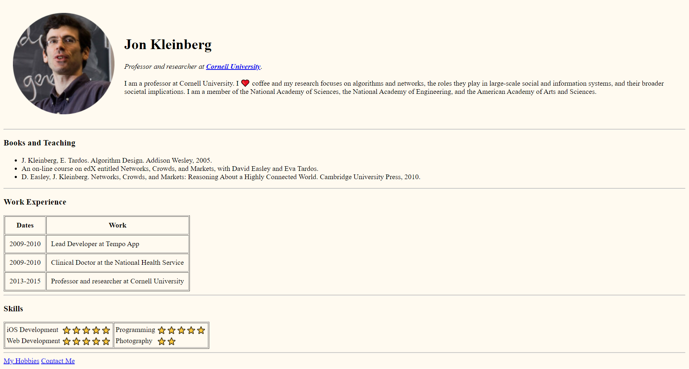

# Sample Portfolio Website

This is a simple portfolio website built using only HTML. The website showcases the author's work and provides information about the author's skills and experience.

## Features

This website includes the following features:

* Home page: Provides a brief introduction to the author and his skills and experience with links to the other pages.
* Hobbies page: Provides information about the author's hobbies and other interests.
* Contact page: Provides a contact form for users to get in touch with the author.

## Technologies Used

* HTML

## 🛠 Installation and Setup Instructions

1. git clone https://github.com/tawfik575/sample-portfolio-website-html.git
2. cd sample-portfolio-website-html
3. open index.html

## Contributing

This is a sample project and contributions are not necessary. However, if you would like to contribute to the project, please fork the repository and submit a pull request.

## License

This project is licensed under the MIT License. See the LICENSE file for more information.

## Contact

If you have any questions or comments about the project, please contact the project owner at `tawfikbsmrstucse@gmail.com`.